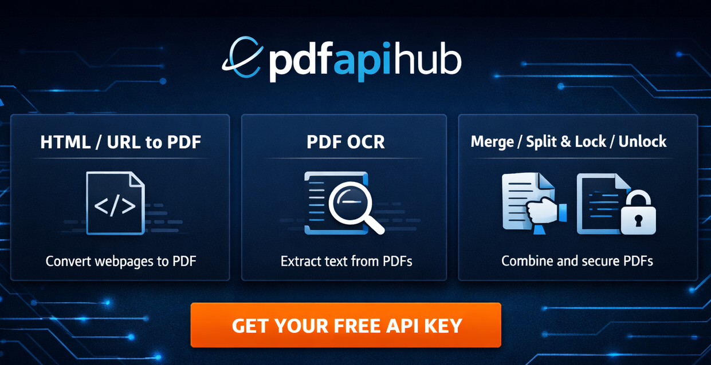

# n8n-nodes-pdf-api-hub

An n8n community node for **PDF API Hub** (Get your api key from [https://pdfapihub.com](https://pdfapihub.com)) that can:

- Parse PDFs and extract text/structured data
- OCR PDFs/images into searchable text
- Merge and split PDFs
- Compress PDFs
- Lock and unlock password-protected PDFs
- Convert images to PDF (PNG/WebP/JPG)
- Convert PDFs to images (PNG/WebP/JPG)
- Convert a website URL to a PDF (screenshot)
- Convert HTML/CSS to a PDF
- Convert URL/HTML to image
- Fetch HTML from URL
- Watermark PDF/image files

## Table of contents

- [Install](#install)
- [Get your API key (PDF API Hub)](#get-your-api-key-pdf-api-hub)
- [Credentials setup (n8n)](#credentials-setup-n8n)
- [How outputs work (URL vs File vs Base64)](#how-outputs-work-url-vs-file-vs-base64)
- [Operations](#operations)
  - [PDF Parse / Extract Text](#pdf-parse--extract-text)
  - [PDF OCR Parse](#pdf-ocr-parse)
  - [Image OCR Parse](#image-ocr-parse)
  - [PDF Merge](#pdf-merge)
  - [PDF Split](#pdf-split)
  - [PDF Compress](#pdf-compress)
  - [PDF Lock](#pdf-lock)
  - [PDF Unlock](#pdf-unlock)
  - [Image to PDF (PNG/WebP/JPG)](#image-to-pdf-pngwebpjpg)
  - [PDF to Image (PNG/WebP/JPG)](#pdf-to-image-pngwebpjpg)
  - [URL to PDF (Website Screenshot)](#url-to-pdf-website-screenshot)
  - [HTML to PDF](#html-to-pdf)
  - [URL to Image](#url-to-image)
  - [HTML to Image](#html-to-image)
  - [URL to HTML](#url-to-html)
  - [Watermark (PDF/Image)](#watermark-pdfimage)
- [Support](#support)

## Install

Follow the official n8n community node install docs:
https://docs.n8n.io/integrations/community-nodes/installation/

In n8n:

1. Go to **Settings → Community Nodes**
2. Click **Install a community node**
3. Enter: `n8n-nodes-pdf-api-hub`
4. Click **Install**

## Get your API key (PDF API Hub)

1. Go to https://pdfapihub.com
2. Sign up / log in
3. Open your dashboard and find the **API Key / API Keys** section
4. Create/copy your API key

If the UI changes, use the official docs as the source of truth:
https://pdfapihub.com/docs

## Credentials setup (n8n)

1. In n8n, go to **Credentials**
2. Create a credential: **PDF API Hub API**
3. Paste your API key
4. Save

This node authenticates by sending:

- Header: `CLIENT-API-KEY: <your-key>`
- Requests are made against: `https://pdfapihub.com/api/v1`

## How outputs work (URL vs File vs Base64)

Many operations offer an output format/type:

- **URL**: the API returns a URL in the JSON response
- **File**: the node downloads the generated PDF/ZIP and returns it as **binary data** in n8n (`binary.data`)
- **Base64**: the API returns base64 in the JSON response

Tip: If you choose **File**, you can pass the binary to nodes like **Write Binary File**, **Google Drive**, **S3**, **Email**, etc.

URL normalization:

- If a URL does not start with `http://` or `https://`, this node auto-adds `https://`.
- If it already starts with `http://` or `https://`, it is used as-is.

## Operations

API reference docs:
https://pdfapihub.com/docs

### PDF Parse / Extract Text

- Endpoint: `POST https://pdfapihub.com/api/v1/pdf/parse`
- Node: **Resource** → PDF Parse / Extract Text
- Operation: **Extract Text / Parse PDF**

Parameters:

- **Input Type**: `url` or `file`
- **PDF URL**: Publicly accessible PDF URL (URL mode)
- **Binary Property Name**: incoming binary PDF (File mode)
- **Parse Mode**: `text` (default), `layout`, `tables`, `full`
- **Pages**: `all` or a range like `1-3`

Returns: JSON (extracted text/structure)

### PDF OCR Parse

- Endpoint: `POST https://pdfapihub.com/api/v1/pdf/ocr/parse`
- Node: **Resource** → OCR to Searchable Text (PDF/Image)
- Operation: **PDF OCR Parse**

Parameters:

- **PDF URL** (default: `https://pdfapihub.com/sample-pdfinvoice-with-image.pdf`)
- **Pages**: page number or `all` (default: `1`, max supported: `8`)
- **Language**, **DPI**, **PSM**, **OEM**

Returns: JSON (OCR text)

### Image OCR Parse

- Endpoint: `POST https://pdfapihub.com/api/v1/image/ocr/parse`
- Node: **Resource** → OCR to Searchable Text (PDF/Image)
- Operation: **Image OCR Parse**

Parameters:

- **Image Input Type**: `url` or `base64`
- **Image URL** (default: `https://pdfapihub.com/sample-invoicepage.png`) (URL mode)
- **Base64 Image** (Base64 mode)
- **Language**, **PSM**, **OEM**

Returns: JSON (OCR text)

### PDF Merge

- Endpoint: `POST https://pdfapihub.com/api/v1/pdf/merge`
- Node: **Resource** → PDF Merge / Split / Compress
- Operation: **Merge PDF**

Parameters:

- **Input Type**: `url` (URLs) or `file` (Binary upload)
- **URLs**: list of PDF URLs (in order) (when Input Type = URL)
- **Binary Property Names**: one or more incoming binary properties containing PDFs (when Input Type = File)
- **Output Format**: `url` / `file` / `base64`

Returns:

- `url` / `base64`: JSON
- `file`: binary PDF

### PDF Split

- Endpoint: `POST https://pdfapihub.com/api/v1/pdf/split`
- Node: **Resource** → PDF Merge / Split / Compress
- Operation: **Split PDF**

Parameters:

- **Input Type**: `url` or `file`
- **PDF URL**: URL of the PDF to split (URL mode)
- **Binary Property Name**: incoming binary PDF (File mode)
- **Split Type**:
  - `pages` (extract specific pages)
  - `each` (split every page)
  - `chunks` (split into N chunks)
- **Pages**: e.g. `1-3,5` (only for `pages`)
- **Number of Chunks**: (only for `chunks`)
- **Output Format**: `url` / `file` / `base64`

Returns:

- `url` / `base64`: JSON
- `file`: binary (often a ZIP or PDF, depending on the API response)

### PDF Compress

- Endpoint: `POST https://pdfapihub.com/api/v1/compressPdf`
- Node: **Resource** → PDF Merge / Split / Compress
- Operation: **Compress PDF**

Parameters:

- **Input Type**: `url` or `file`
- **PDF URL** (URL mode)
- **Binary Property Name** (File mode)
- **Compression Level**: `low` / `medium` / `high` / `max`
- **Output Type**: `url` / `file` / `base64`
- **Output Filename**: used when output is file

Returns:

- `url` / `base64`: JSON
- `file`: binary PDF

### PDF Lock

- Endpoint: `POST https://pdfapihub.com/api/v1/lockPdf`
- Node: **Resource** → PDF Security (Lock / Unlock)
- Operation: **Lock PDF**

Parameters:

- **Input Type**: `url` or `file`
- **PDF URL** (URL mode)
- **Binary Property Name** (File mode)
- **Password**: password to set
- **Input Password**: optional (if the input PDF is already encrypted)
- **Output Type**: `url` / `file` / `base64`
- **Output Filename**

Returns:

- `url` / `base64`: JSON
- `file`: binary PDF

### PDF Unlock

- Endpoint: `POST https://pdfapihub.com/api/v1/unlockPdf`
- Node: **Resource** → PDF Security (Lock / Unlock)
- Operation: **Unlock PDF**

Parameters:

- **Input Type**: `url` or `file`
- **PDF URL** (URL mode)
- **Binary Property Name** (File mode)
- **Password**: password to unlock
- **Output Type**: `url` / `file` / `base64`
- **Output Filename**

Returns:

- `url` / `base64`: JSON
- `file`: binary PDF

### URL to PDF (Website Screenshot)

- Endpoint: `POST https://pdfapihub.com/api/v1/generatePdf`
- Node: **Resource** → Website / HTML to PDF
- Operation: **URL to PDF**

Parameters:

- **URL**: website URL to capture
- **Full Page**: capture full page or viewport
- **Wait Till**: delay in ms before capture
- **Viewport Width / Height**
- **Output Format**: `url` / `file`
- **Output Filename**
- **Timeout**: request timeout in seconds

Returns:

- `url`: JSON with a PDF URL
- `file`: binary PDF

### Image to PDF (PNG/WebP/JPG)

- Endpoint: `POST https://pdfapihub.com/api/v1/convert/image/pdf`
- Node: **Resource** → Image to PDF
- Operations: **PNG to PDF**, **WebP to PDF**, **JPG to PDF**

Parameters:

- **Input Type**: `url` / `base64` / `file`
- URL placeholders:
  - PNG: `https://pdfapihub.com/sample.png`
  - WebP: `https://pdfapihub.com/sample.webp`
  - JPG: `https://pdfapihub.com/sample.jpg`
- **Output Format**: `url` / `base64` / `both` / `file`
- **Output Filename**

### PDF to Image (PNG/WebP/JPG)

- Endpoint: `POST https://pdfapihub.com/api/v1/convert/pdf/image`
- Node: **Resource** → PDF to Image
- Operations: **PDF to PNG**, **PDF to WebP**, **PDF to JPG**

Parameters:

- **Input Type**: `url` or `file`
- **PDF URL** (URL mode)
- **Binary Property Name** (File mode)
- **Pages**, **DPI**, **Quality**, **Output Format**

### HTML to PDF

- Endpoint: `POST https://pdfapihub.com/api/v1/generatePdf`
- Node: **Resource** → Website / HTML to PDF
- Operation: **HTML to PDF**

Parameters:

- **HTML Content**
- **CSS Content**
- **Dynamic Params**: optional key/value replacements for templating
- **Viewport Width / Height**
- **Output Format**: `url` / `file`
- **Output Filename**
- **Timeout**: request timeout in seconds

Returns:

- `url`: JSON with a PDF URL
- `file`: binary PDF

### URL to Image

- Endpoint: `POST https://pdfapihub.com/api/v1/generateImage`
- Node: **Resource** → Website / HTML to Image
- Operation: **URL to Image**

Returns JSON or binary image (based on output format).

### HTML to Image

- Endpoint: `POST https://pdfapihub.com/api/v1/generateImage`
- Node: **Resource** → Website / HTML to Image
- Operation: **HTML to Image**

Returns JSON or binary image (based on output format).

### URL to HTML

- Endpoint: `POST https://pdfapihub.com/api/v1/url-to-html`
- Node: **Resource** → URL to HTML
- Operation: **Fetch HTML**

Defaults include URL `http://example.com/`.

### Watermark (PDF/Image)

- Endpoint: `POST https://pdfapihub.com/api/v1/watermark`
- Node: **Resource** → Watermark PDF
- Operation: **Add Watermark**

Supports URL/base64/file input and file/url/base64/both output.

## Support

- PDF API Hub documentation: https://pdfapihub.com/docs
- Website: https://pdfapihub.com
- Issues/bugs: https://github.com/Pdfapihub/n8n-nodes-pdf-api-hub/issues

## License

[MIT](LICENSE.md)
