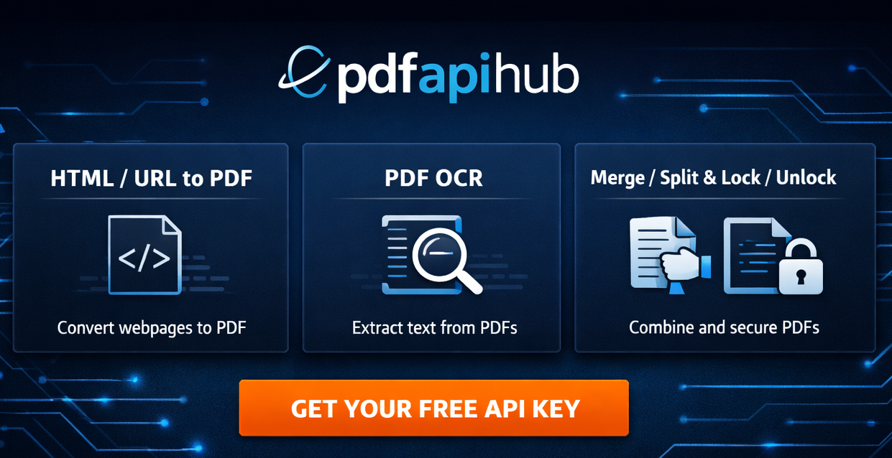

# n8n-nodes-pdf-api-hub

> **The most powerful PDF toolkit for n8n** — 30+ operations, one node.

Turn any webpage into a PDF, sign documents, extract tables to Excel, OCR scanned pages, merge/split/compress PDFs, and much more — all inside your n8n workflows.

🔑 **[Get your free API key →](https://pdfapihub.com)**

---

## 🚀 Install

1. In n8n, go to **Settings → Community Nodes**
2. Click **Install a community node**
3. Enter: `n8n-nodes-pdf-api-hub`
4. Click **Install**

> Official guide: [n8n Community Nodes Installation](https://docs.n8n.io/integrations/community-nodes/installation/)

## 🔑 Get your API key

1. Go to **[pdfapihub.com](https://pdfapihub.com)** and sign up (free tier available)
2. Copy your **API key** from the dashboard

> 📖 Full API docs: [pdfapihub.com/docs](https://pdfapihub.com/docs)

## 🔐 Set up credentials in n8n

1. In n8n, go to **Credentials → New**
2. Search for **PDF API Hub API**
3. Paste your API key → **Save**

That's it! The node handles everything automatically.

---

## ✨ What you can do

| # | Resource | Operations | What it does |
|---|----------|-----------|-------------|
| 1 | **HTML / URL to PDF** | HTML to PDF, URL to PDF | Render HTML or capture any webpage as a pixel-perfect PDF with custom paper size, margins, fonts, and viewport |
| 2 | **Sign PDF** | Sign PDF, Add Watermark | Stamp a signature image or overlay text/logo watermarks on every page |
| 3 | **Screenshot to Image** | URL to Image, HTML to Image | Capture full-page screenshots or render HTML to PNG with retina support |
| 4 | **OCR** | PDF OCR, Image OCR | Extract text from scanned documents and photos — supports English, Portuguese, Russian, and custom languages |
| 5 | **Extract Text & Tables** | Parse PDF | Pull text, tables, or structured layout data from any PDF |
| 6 | **PDF to Excel & More** | PDF → XLSX, CSV, DOCX, TXT, HTML, PPTX | Convert PDFs into editable spreadsheets, Word docs, presentations, and more |
| 7 | **Merge / Split** | Merge PDF, Split PDF | Combine multiple PDFs or split one into pages, ranges, or equal chunks |
| 8 | **Compress PDF** | Compress PDF | Shrink file size with 4 compression levels (low → max) |
| 9 | **Protect / Unlock** | Lock PDF, Unlock PDF | Add AES-256 encryption with granular permissions, or remove password protection |
| 10 | **Scrape Website** | Fetch HTML | Get fully-rendered HTML from any URL using a headless browser — perfect for SPAs |
| 11 | **Images to PDF** | PNG/JPG/WebP to PDF | Combine images into a PDF with page size, orientation, and fit mode options |
| 12 | **PDF to Image** | PDF to PNG/JPG/WebP | Render PDF pages as images with DPI, resize, and background color control |
| 13 | **Compare Documents** | Similarity Check | Compare two PDFs or images for visual similarity |
| 14 | **File Management** | Upload, List, Delete | Manage your cloud-stored files |

---

## 📖 Operations in detail

### 1. HTML / URL to PDF

Convert HTML or capture any webpage as a PDF.

| Parameter | Description |
|-----------|-------------|
| **HTML Content** | Your HTML template (supports `{{placeholders}}`) |
| **CSS Content** | Optional CSS injected before rendering |
| **URL** | Any public webpage URL |
| **Paper Size** | A0–A6, Letter, Legal, Tabloid, Ledger |
| **Orientation** | Portrait / Landscape |
| **Margins** | None, Small, Medium, Large, or Custom (px/mm/cm/in) |
| **Viewport Size** | Standard, Laptop, Desktop, Mobile, Tablet, or Custom |
| **Output Format** | URL (hosted 30 days), Base64, or Binary File |
| **Load Google Fonts** | Pipe-separated font names (e.g. `Roboto|Inter`) |
| **Dynamic Params** | Key/value pairs for `{{placeholder}}` substitution |
| **Cookie Accept Text** | Auto-click cookie consent popups (URL mode) |
| **Wait Until** | Fully Loaded, DOM Ready, Network Quiet, or First Response |
| **Advanced** | Print background, header/footer, CSS page size, max pages, navigation timeout |

---

### 2. Sign PDF & Watermark

**Sign PDF** — stamp a signature image onto your documents.

| Parameter | Description |
|-----------|-------------|
| **PDF Input** | URL, Base64, or Binary File |
| **Signature** | Image URL or Base64 (PNG/JPG/WebP, transparent PNGs supported) |
| **Page** | Specific page number, or sign all pages |
| **Position** | Bottom Right, Bottom Left, Center, Top Right, etc. |
| **Advanced** | Custom X/Y coordinates, width/height, opacity |

**Add Watermark** — overlay text or a logo across every page.

| Parameter | Description |
|-----------|-------------|
| **Watermark Text** | Any text (default: CONFIDENTIAL) |
| **Opacity** | 0 (invisible) to 1 (fully opaque) |
| **Position** | Center, Top/Bottom Left/Right/Center |
| **Mode** | Single placement or Tiled (repeats diagonally) |
| **Advanced** | Text color, font size, image watermark URL |

---

### 3. Screenshot Website to Image

Capture webpages or render HTML as PNG images.

| Parameter | Description |
|-----------|-------------|
| **URL / HTML** | Webpage URL or HTML content |
| **Output Format** | URL, Base64, Both (URL + Base64), or Binary File |
| **Image Size** | Width × Height in pixels (HTML mode) |
| **Viewport** | Desktop, Laptop, Mobile, Tablet, or Custom |
| **Full Page** | Capture the entire scrollable page (URL mode) |
| **Cookie Accept** | Auto-dismiss consent popups |
| **Advanced** | Device scale factor (2× for retina), quality (30–100) |

---

### 4. OCR — Read Scanned PDFs & Images

Extract text from scanned documents using Tesseract OCR.

| Parameter | Description |
|-----------|-------------|
| **Input** | URL or Binary File (PDF or Image) |
| **Language** | English, Portuguese, Russian, or custom code (e.g. `eng+hin`) |
| **Pages** | All, single page, range (`1-3`), or mixed (`1,3,5-8`) |
| **Detail Level** | Text Only, or Words + Bounding Boxes |
| **Response Format** | JSON (structured) or Plain Text |
| **Advanced (PDF)** | DPI (72–400), character whitelist, PSM, OEM |
| **Advanced (Image)** | Grayscale, sharpen, binarization threshold, resize scale |

---

### 5. Extract PDF Text & Tables

Pull structured data from any PDF — no OCR needed for digital PDFs.

| Parameter | Description |
|-----------|-------------|
| **Input** | URL or Binary File |
| **Parse Mode** | Text Only, Layout (with bounding boxes), Tables, or Full |
| **Pages** | All or specific page selection |

---

### 6. PDF to Excel / CSV / Word / PowerPoint

Convert PDFs into editable formats.

| Operation | Output | Description |
|-----------|--------|-------------|
| **PDF to Excel (XLSX)** | `.xlsx` | Tables extracted into spreadsheet — one sheet per page |
| **PDF to CSV** | `.csv` | Table data in CSV format |
| **PDF to Word (DOCX)** | `.docx` | Editable Word document with optional page selection |
| **PDF to Text** | `.txt` | Plain extracted text |
| **PDF to HTML** | `.html` | Styled HTML document |
| **PDF to PowerPoint** | `.pptx` | Each page becomes a slide |
| **Document to PDF** | `.pdf` | Convert DOCX, PPTX, XLSX, CSV, TXT, ODT → PDF |

All operations support: URL / Binary File input, URL / Base64 / Binary output, optional page selection, and custom output filename.

---

### 7. Merge / Split PDF

**Merge** — combine multiple PDFs into one.

| Parameter | Description |
|-----------|-------------|
| **Input** | PDF URLs (Google Drive links supported) or Binary Files |
| **Output Format** | URL, Base64, or Binary File |
| **Output Filename** | Custom name for the merged file |
| **Advanced** | PDF metadata (title, author, subject, keywords) |

**Split** — break a PDF into parts.

| Parameter | Description |
|-----------|-------------|
| **Split Mode** | Each Page, Specific Pages (`1-3,5,8-`), or Equal Chunks (2–100) |
| **Output** | URL (individual + ZIP), Base64 (ZIP), or Binary (ZIP) |

---

### 8. Compress PDF

Reduce file size with configurable compression.

| Parameter | Description |
|-----------|-------------|
| **Compression Level** | Low, Medium, High (default), or Max |
| **Output Format** | URL, Base64, or Binary File |

> 💡 URL/Base64 responses include compression statistics — original size, compressed size, ratio, and bytes saved.

---

### 9. Protect / Unlock PDF

**Lock** — add password protection with enterprise-grade encryption.

| Parameter | Description |
|-----------|-------------|
| **Password** | Required to open the PDF |
| **Advanced** | Owner password, encryption (AES-256/128, RC4), 8 granular permissions (print, copy, modify, annotate, forms, extract, assemble, high-res print) |

**Unlock** — remove password protection using multiple decryption engines.

---

### 10. Scrape Website HTML

Fetch fully-rendered HTML from any URL using a headless browser.

| Parameter | Description |
|-----------|-------------|
| **URL** | Any public webpage |
| **Wait Until** | Fully Loaded, DOM Ready, Network Quiet, or First Response |
| **Wait for Element** | CSS selector to wait for (great for SPAs) |
| **Extra Delay** | Additional milliseconds after page load |
| **Viewport** | Desktop, Laptop, Mobile, Tablet, or Custom |
| **Advanced** | Navigation timeout, custom User-Agent, extra HTTP headers |

---

### 11–12. Images ↔ PDF

**Images to PDF** — combine images into a document.

| Parameter | Description |
|-----------|-------------|
| **Page Size** | Original (match image), A3, A4, A5, Letter, Legal, Tabloid |
| **Fit Mode** | Fit (preserve aspect), Fill (may crop), Stretch, or Original |
| **Orientation** | Portrait / Landscape |
| **Margin** | 0–200 points padding |

**PDF to Image** — render pages as PNG, JPG, or WebP.

| Parameter | Description |
|-----------|-------------|
| **DPI** | 72–300 (higher = sharper) |
| **Quality** | 1–100 (JPG/WebP) |
| **Advanced** | Resize width/height, background color for transparent PNGs |

---

### 13. Compare Documents

Check visual similarity between two PDFs or images.

| Parameter | Description |
|-----------|-------------|
| **Input** | Two URLs, two Base64 strings, or two Binary Files |
| **Method** | Auto (default), Feature Match, SSIM, or PHash |

---

### 14. File Management

Manage files in your cloud storage.

| Operation | Description |
|-----------|-------------|
| **Upload File** | Upload any file — returns hosted URL (auto-deleted after 30 days) |
| **List Files** | List all your uploaded files (newest first, limit 1–500) |
| **Delete File** | Delete a file by URL (ownership enforced) |

---

## 🔌 How output formats work

Most operations let you choose how to receive the result:

| Format | Best for | What you get |
|--------|---------|-------------|
| **URL (Hosted Link)** | Sharing, webhooks, storing | A downloadable URL — file hosted for 30 days |
| **Base64 (Inline Data)** | Embedding in emails, chaining nodes | The file as a base64 string inside JSON |
| **Binary File** | Piping to Google Drive, S3, Email, etc. | Raw binary data you can pass to any n8n file node |

> 💡 **Tip**: Choose **Binary File** when you want to pass the output directly to nodes like Write Binary File, Google Drive, AWS S3, or Send Email.

---

## 💬 Support & resources

- 🔑 **Get API key**: [pdfapihub.com](https://pdfapihub.com)
- 📖 **API documentation**: [pdfapihub.com/docs](https://pdfapihub.com/docs)
- 🐛 **Report a bug**: [GitHub Issues](https://github.com/Pdfapihub/n8n-nodes-pdf-api-hub/issues)
- 💬 **Questions**: [support@pdfapihub.com](mailto:support@pdfapihub.com)

---

## 📄 License

[MIT](LICENSE.md)

---

  
   
  <strong>Made with ❤️ by <a href="https://pdfapihub.com">PDF API Hub</a></strong>

